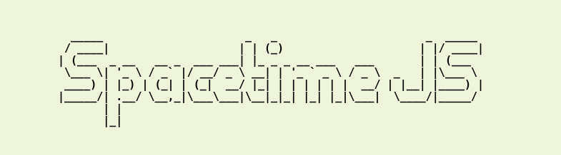
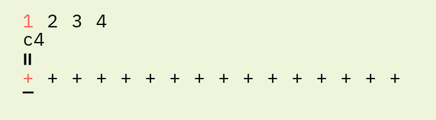
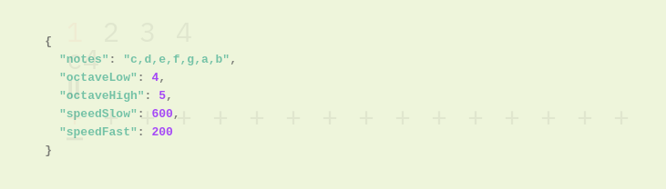
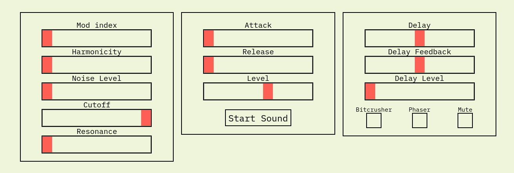

## [LIVE DEMO](https://gabrieldavison.github.io/spacetimeJS/)

This project is derived from [a study](https://monome.org/docs/norns/study-3/) originally written in lua for the [monome norns](https://monome.org/docs/norns/). This implementation is written in Javascript and uses my synthesizer project [Engine](https://github.com/gabrieldavison/engine) to generate the sounds.

## The Sequencer

SpacetimeJS consists a sequenced set of commands, each of these commands has an effect on which note is played or on the sequencer itself.

### Sequencer Commands:

- \+ Increments current note up the scale by one.
- \- Decrements current note down the scale by one.
- < Sets current note to the lowest note in the scale
- \> Sets current note to the highest note in the scale.
- \- Sets current note to a random note in the current octave.
- f Sets speed to fast.
- s Sets speed to slow.
- \# Skips to a random position in the sequence.
- \_ Skips current step.
- = Plays current note (Same as previous step)

## The Controls

Use numbers keys 1,2,3,4 to switch between sequencer presets.

Use the left/right arrows to move the edit position on the sequencer and the up/down arrows to change the command for the current step.

Pressing \<escape> will display the configuration screen for the selected sequencer. This is a text file that can edited to change certain variables.

### Sequencer Variables:

- "notes": notes of the scale
- "octaveLow": lowest octave the sequencer will play
- "octaveHigh": highest octave the sequencer will play
- "speedFast": fast speed in ms
- "speedSlow": slow speed in ms

## The Sound Engine

The sliders below the sequencer are used to modify the timbral quality of the sound.

You can read more about how the sound is generated and how the controls work in the [docuemntation for Engine](https://github.com/gabrieldavison/engine) as these two projects share the same controls.
